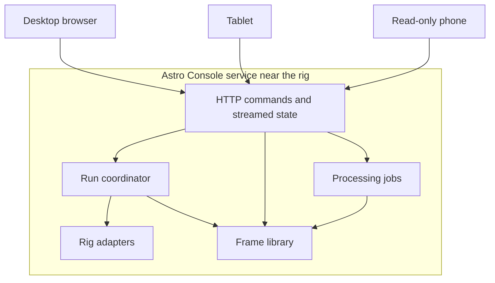
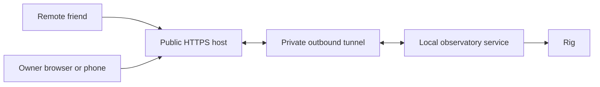

# V2 Web Architecture

> Archived exploratory architecture. The current infrastructure authority is
> [the infrastructure plan](../../infra/README.md).

## 1. Architectural Direction

V2 replaces Electron as the product architecture with a browser application
served by a local Astro Console service. The service runs near the physical
equipment and owns all hardware, workflow, storage, and processing behavior.

Dropping Electron does not remove the frontend/backend boundary. It replaces a
desktop-specific IPC boundary with a standard reusable network contract.

## 2. Responsibilities

### Observatory Service

The service owns:

- discovery and connection;
- rig adapters and vendor protocols;
- the canonical observatory and active-run state;
- operation coordination and cancellation;
- plan execution;
- frame acquisition and persistence;
- preview and quality generation;
- processing jobs;
- control ownership;
- event and operational history needed by the UI.

An active run continues when all browsers disconnect.

### Web Client

The web client owns:

- workspace navigation;
- local draft editing;
- selected rows, open panels, comparison state, and other presentation state;
- rendering canonical streamed state;
- invoking typed domain commands;
- responsive layouts for desktop, tablet, and phone.

The client does not infer vendor state or become authoritative for run
progress.

### Shared Contracts

Effect Schemas should be the canonical transport contract for commands, query
results, streamed events, and snapshots.

The architecture should avoid maintaining separate shapes solely for domain,
IPC, preload, and renderer compatibility. Separate models remain appropriate
only when they represent genuinely different concepts:

- internal domain state;
- transport-safe API contract;
- client-local presentation state.

Unknown input is decoded at the service boundary and again when the browser
receives untrusted network data. Command handlers remain thin; workflows own
orchestration and state transitions.

## 3. Transport Model

The initial transport can remain simple:

- HTTP for typed commands and bounded queries;
- WebSocket or server-sent events for snapshots, run progress, warnings, and
  frame availability;
- ordinary HTTP for previews, thumbnails, and explicit asset downloads.

The exact framework is intentionally undecided. The contract and ownership
model matter more than the transport library.

The service should support reconnecting clients by publishing a current
snapshot before incremental events. Clients must not need to replay an entire
session log to become correct.

## 4. Local Deployment

The first deployment target is one service running on a computer with local
network access to the rig.

- The service starts independently of a browser.
- It serves the V2 frontend and API.
- A browser opens the local service URL.
- Closing or refreshing the browser does not affect hardware activity.
- The service owns storage paths and processing executables.

Because the current application is unpublished, V2 does not need an
Electron-compatibility product mode. Migration may be direct while selectively
reusing proven backend modules.

## 5. Remote Sharing

The desired remote experience is a trusted friend opening a stable public URL
and viewing or, when granted, controlling the observatory several hours away.

### Initial Topology

Use the existing Linux server as a public front door and keep all device access
local to the rig.

The local side initiates the private connection outward. The public host
terminates HTTPS, authenticates users, and proxies ordinary HTTP and streaming
traffic to the local service. This avoids inbound home-network ports and does
not require a custom bridge protocol for the first version.

The public host may serve the frontend itself or proxy the complete local
application. Prefer a same-origin browser experience so the client does not
need to coordinate a remote UI origin with a private local API origin.

### Later Hub Option

If a reverse tunnel becomes limiting, introduce a small hub:

- the local observatory service maintains an outbound connection;
- the hub tracks observatory presence and routes typed messages;
- browsers connect only to the hub;
- the local service remains authoritative and continues active work when the
  internet connection fails;
- the hub reports offline state rather than attempting hardware recovery.

This is a later evolution, not the required starting architecture.

### Bandwidth

Remote clients should receive status, telemetry, thumbnails, and appropriately
sized previews. Original camera frames may be large and remain local unless a
user explicitly requests a download. Processing also remains near the stored
assets.

## 6. Authentication And Control Ownership

Authentication should be delegated to a managed provider that supports a
small-project-friendly combination of Google login, passwordless login, or
passkeys. Astro Console should not store or verify user passwords.

The application needs only a small authorization model:

- `viewer`: may inspect observatory state, plans, previews, warnings, and
  library metadata;
- `controller`: temporarily owns the exclusive control lease;
- `owner`: may grant or take back control and manage the observatory.

These are product roles, not an enterprise policy system. A single person may
normally be both owner and controller.

Remote control should be explicit and visible:

1. a friend requests control;
2. the current owner grants it, or a configured idle policy permits it;
3. every client displays the current controller;
4. only the controller may issue observing mutations;
5. the owner can take back control.

The initial phone client is always a viewer.

## 7. Proportionate Security Baseline

V2 is a personal project, not a commercial multi-tenant platform. The minimum
controls are those required to avoid accidentally exposing physical equipment
or the host computer:

- HTTPS on the public endpoint;
- managed authentication;
- one visible control lease;
- typed Astro Console commands rather than arbitrary remote execution;
- an outbound connection from the rig network;
- server-side authorization for every mutation;
- bounded asset access owned by the library subsystem.

V2 does not initially need organization administration, fine-grained policy
languages, compliance reporting, elaborate role hierarchies, or locally
managed credentials.

## 8. Failure And Reconnection

- Browser disconnect: the run continues; reconnect receives a fresh snapshot.
- Remote tunnel failure: local work continues; remote clients show offline.
- Service restart: recover only from intentionally persisted run state and
  reconcile with hardware before resuming.
- Controller disconnect: do not implicitly stop a run; release or retain the
  lease according to a simple explicit timeout policy.
- Processing failure: preserve source assets and completed intermediate
  artifacts; do not affect observing control.
- Hardware failure: the run coordinator owns bounded retry, recovery, stop, and
  park behavior.

## 9. Electron Migration Boundary

### Preserve When Sound

- provider-neutral rig contracts;
- Seestar and Alpaca protocol implementations;
- Effect workflow and lifecycle logic;
- operation coordination and recovery precedence;
- frame persistence, FITS, preview, and library behavior;
- deterministic fake scenarios and recorded-frame tests.

### Replace

- Electron application lifecycle as the product host;
- preload bridge;
- Electron IPC handlers and IPC-specific contracts;
- current renderer projection plumbing where it exists only for IPC;
- single-pane desktop shell;
- browser-hostile assumptions about local file and process access.

### Re-evaluate

- current `DesktopStatus` aggregation boundaries;
- projector responsibilities that mix domain decisions with labels;
- storage paths and open/reveal actions;
- preview transport and caching;
- dev inspection and fake-scenario controls;
- which packages remain named `desktop` after the migration.

The migration should not mechanically expose every old IPC operation as an
HTTP endpoint. V2 contracts should reflect the new product entities and
workspace workflows.

## 10. Architectural Acceptance Outcomes

- The observatory service can run without any open browser.
- Multiple clients can observe the same canonical run state.
- Exactly one authorized client can control the rig at a time.
- Desktop and phone clients consume the same contracts with different layouts
  and capabilities.
- Local and remote clients reconnect from a current snapshot.
- Hardware, storage, and processing remain inaccessible except through typed
  domain operations.
- Remote disconnection cannot interrupt local observing.
- The Electron-specific transport and duplicated compatibility models are no
  longer required by the product.
