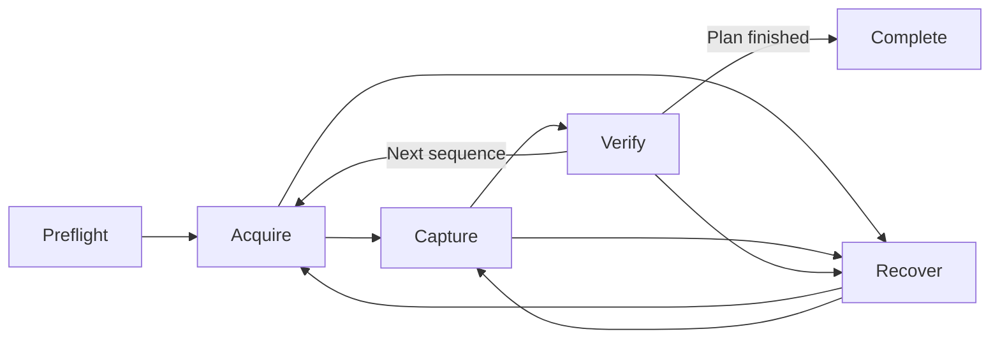

# V2 Product Specification

Status: **living product specification — V2.0 complete; V2.1 Phases 1–4 complete**

Last reconciled: August 5, 2026 against the delivered V2.0 workspaces and
remote-access model, the V2.1 Alpaca inventory and camera boundaries, and the
local plate-solve evidence worker. V2.1 outdoor acquisition and capture remain
planned work.

Read this only when workspace behavior or product-entity detail is needed. The
default V2 context begins at [Start Here](../README.md).

## Document Role And Maintenance

This document states **what V2 currently is**. It is updated when:

- an interaction gate closes;
- an accepted decision changes a workspace or cross-workspace handoff;
- infrastructure creates user-visible behavior or availability semantics; or
- contract work exposes a conflict in the current product model.

It does not accumulate prototype experiments, rejected alternatives,
walkthrough history, implementation plans, schema details, or copy polish.
Those belong in accepted [gate records](../gates/README.md), the
[documentation archive](../archive/README.md), the contract harness, or the
[delivery plan](delivery-plan.md). The
[UX and design guidance](../ux-design-guidance.md) remains the authority for
how design decisions are made.

## 1. Product Definition

V2 is a web-first personal observatory workspace over a durable rig-local
service. It helps an operator decide what to observe, acquire it safely,
evaluate the evidence, and develop useful results without requiring the
browser to own long-running work. V2.0 delivers the Plan, Observe, Library,
and Process workspace model with remote viewing and bounded shared control.
V2.1 adds one configured Alpaca-rig boundary for real capability observation,
bounded camera exposure, immutable original intake, and local solve evidence.

It is designed for one observatory shared with a few trusted people. It is not
a commercial multi-tenant platform, a generic device dashboard, or an
enterprise operations product. **Nightbook** is the user-facing V2 workspace;
Astro Console remains the project and service name.

The product should answer three questions in order:

1. What is the observatory doing, and is it healthy?
2. What decision or intervention is useful now?
3. What evidence explains that recommendation?

The historical shell review that motivated the V2 reset is preserved in the
[archive](../archive/research/v1-shell-review.md); it is not part of current
product truth.

## 2. Product Model

V2 distinguishes stable workspaces from transient observing phases.

### Workspaces

| Workspace | Primary question |
| --- | --- |
| Plan | What should the observatory do, and is the plan viable? |
| Observe | What is the active run doing, and does it need intervention? |
| Library | What was captured, and is it good evidence? |
| Process | How should selected evidence become a better derived result? |

Workspaces are freely switchable. Leaving `Observe` never pauses or cancels an
active run. An operator may process an older session, prepare another night, or
review frames while observing continues.

### Active Run Phases

- `Preflight` validates the site, rig, plan, ownership, storage, and safe state.
- `Acquire` prepares the session or target through alignment, slew, solve,
  center, focus, filter, and related setup.
- `Capture` executes the accepted sequence settings and stop conditions.
- `Verify` judges physical outcome and frame quality before accepting progress.
- `Recover` pauses ordinary work and guides retry, correction, skip, stop, or
  park decisions.
- `Complete` records the run outcome and exposes its results.

The Observe workspace changes with the phase. The phase is not a tab the user
must select manually.

## 3. Core Product Entities And Authority

The UI should be designed around durable domain concepts rather than component
state.

| Entity | Responsibility |
| --- | --- |
| Observatory | Site, horizon, equipment, service health, and shared identity |
| Rig | A connected set of callable mount, camera, focuser, filter, and storage capabilities |
| Observing Plan | Ordered and constrained work proposed for a site, rig, and observing window; it is not limited to nighttime targets |
| Sequence | One target's acquisition contract, capture settings, stop conditions, and failure policy |
| Active Run | Immutable `RunDefinition` plus explicit approved runtime changes and current execution state |
| Acquisition Attempt | Evidence and corrections used to align, solve, center, and prepare a target |
| Frame | Durable captured evidence with settings, metrics, provenance, and review status |
| Asset | Stable identity, lineage, checksums, representations, availability, and authorization for original or derived evidence |
| Configured Rig | One selected Alpaca endpoint and its observed device identities, capabilities, connection state, and safe-state facts; it is not a browser-side device client |
| Processing Session | A durable, resumable Build/Develop working resource with linear applied history, synchronized preview state, working outputs, checkpoints, and references to any saved Library artifacts; it is not itself a Library asset |
| Control Lease | The single client currently authorized to issue observing commands |
| Client Presence | Ephemeral authenticated viewer identity, device, freshness, and capability; never authority by itself |

The Astro Console service owns accepted run execution, mutation impact,
current rig and workflow state, processing sessions, asset identity, presence,
and the exclusive control lease. It decodes Alpaca provider data at its adapter
boundary and records later observation or image evidence separately from a
provider acknowledgement. These facts do not belong to a workspace, React
tree, browser tab, or connected client.

### Identity, Presence, And Control

- An authenticated person has local `owner` or `viewer` membership.
- `controller` is a temporary, exclusive service-owned lease, not a permanent
  membership role.
- Presence shows who is viewing but grants no authority.
- A control request grants nothing until an explicit owner grant. Owner
  takeover, release, grace expiry, and reconnect never silently transfer
  control or stop accepted work.
- The exact reconnect-grace duration remains a policy to validate. Grace
  expiry releases the lease to no controller.
- The first phone client is always read-only, including for the owner, and
  cannot request or hold the control lease.

### Revisions, Freshness, And Reconnect

The product keeps source-plan revision, current run revision, complete snapshot
version, incremental event cursor, control-lease revision, and processing
revision conceptually distinct. Primary UI uses semantic state; raw identifiers
remain secondary diagnostics.

- Every consequential intent is checked against current service-owned truth.
  Stale run, lease, or processing intent fails before physical or durable
  action.
- A disconnected client disables service mutations and shows last-confirmed
  time or stale evidence honestly. The accepted run continues on the service.
- Reconnect is snapshot-first: replace canonical projection from a fresh
  snapshot, summarize durable changes while away, then accept newer events.
- Browsers do not buffer observing commands or automatically replay them after
  reconnect.
- The web app holds no durable domain state. Refresh discards browser memory
  and installs the server snapshot without merging an older local copy.
  Workspace navigation and genuinely unsent interaction may exist only for the
  current page lifetime.

## 4. Global Application Shell

The shell should remain small and stable while workspace content changes.

### Primary Navigation

- Plan
- Observe
- Library
- Process

Rig configuration, account controls, development tools, and application
settings belong in secondary navigation. They are not workspaces.

### Persistent Run Activity

When a run is active, every workspace shows a compact activity surface with:

- target and current phase;
- progress and estimated time remaining;
- health or warning state;
- current controller;
- a clear `Return to Observe` action;
- service-level attention that remains relevant outside its owning workspace.

Routine telemetry remains inside Observe. Only state that may change the
operator's decision interrupts other workspaces.

The shell does not duplicate Plan or Observe commands. Plan owns active-run
edits. Observe owns pause, resume, skip, stop, and recovery interventions.
`Return to Observe` takes the operator to the proper action surface.

The UI distinguishes Astro Console service availability, rig connectivity,
public-tunnel availability, processing availability, artifact publication, and
storage pressure. A failed public tunnel means remote access is unavailable;
it does not imply the observatory or accepted run stopped.

### Remote Viewing And Shared Control

- Cloudflare Access admits trusted remote clients to the rig-local service; it
  is ingress and identity admission, not observatory authority.
- Remote phone clients are read-only. A remote desktop client may request the
  existing service-owned control lease; owner grant, release, decline, and
  takeover stay explicit.
- The shell shows the admitted identity, membership, remote availability,
  controller, lease/presence state, and why an action is unavailable. It does
  not expose provider paths, host paths, tokens, or driver diagnostics.
- Remote previews are deliberately bounded. Original download remains an
  explicit authorized Library action, never routine viewing data.
- Tunnel or Access loss changes remote availability only. A local owner route
  continues to show the service-owned state and does not stop accepted work.

### Information Hierarchy

V2 uses three layers:

1. **Glance:** activity, health, progress, and urgent state;
2. **Decision:** the recommended or available action now;
3. **Evidence:** telemetry, logs, settings, and diagnostics explaining the
   decision.

Dense information belongs in the evidence layer. It should not compete with
the current decision.

### Warnings And Problems

A warning must never be only a count. It should expose:

- what happened;
- severity;
- operational consequence;
- recommended remedy;
- whether the run can continue;
- the evidence that produced the warning.

Warnings and informational notices are priority-sorted attention, not a
permanent empty `Decision now` slot. They are accessible globally and expanded
contextually in the workspace that can resolve them.

## 5. Plan Workspace

Plan composes and validates future observing work. It should not look like a
catalog with capture controls attached.

### Primary Layout

- A sequence list or timeline expressing the proposed order.
- An observing-window visualization showing altitude, horizon clearance, and
  usable time.
- A contextual editor for the selected sequence.
- A readiness summary for the complete plan.
- A prominent `Run plan` action after validation.

### Sequence Contents

Each sequence may define:

- target and framing;
- acquisition requirements;
- capture mode and exposure settings;
- filter and focus requirements;
- earliest and latest start;
- minimum altitude and horizon clearance;
- desired duration, frame count, or quality goal;
- cadence and recenter thresholds;
- storage forecast;
- stop conditions;
- retry, skip, pause, and park behavior;
- fallback target or optional priority.

The catalog must be virtualized or paginated. Target discovery should support
search, favorites, recent targets, viability, and recommendation without
mounting the entire catalog into the document.

### Plan Validation

Validation should identify conflicts before execution:

- target not visible during its proposed window;
- local horizon or obstruction conflict;
- insufficient usable time;
- storage shortfall;
- unavailable capability;
- ambiguous rig ownership;
- unsafe or unknown critical state;
- mutually incompatible sequence requirements.

Readiness should distinguish `ready`, `ready with limitations`, and `blocked`.
Blocking state fails closed when the missing information is truly critical.

### Accepted Run Definition

Pressing `Run plan` requires the current exclusive control lease and creates a
stable `RunDefinition`. Later edits to a draft or another night do not
silently mutate the active run.

Changes to the active run are explicit, revision-guarded operations. The
service classifies impact and supplies exact physical, evidence, schedule,
time, and storage consequences. Clients explain that result; they do not infer
impact from button names or phase.

#### Non-disruptive

- Add or reorder work after the active sequence.
- Add notes.
- Change a different draft plan.
- Adjust future priorities without changing current behavior.

#### Notice

- Modify the next sequence.
- Change remaining duration or a later stop condition.
- Remove queued work.

#### Disruptive

- Abort the current exposure.
- Change the active target.
- Move the mount.
- Change the active filter or acquisition contract.
- Restart acquisition.
- Discard current progress.
- Disable a readiness or safety constraint.

#### Ineligible

An unsafe, stale, unauthorized, or impossible change is not offered as a
generic failed action. The interface explains the blocking invariant and shows
only valid alternatives. No partial state or hardware action occurs.

The approval describes the concrete consequence, not merely `Are you sure?`.
For example:

> Applying this change will abort the current exposure, discard its elapsed
> time, slew away from the active target, and begin acquisition for the new
> target.

## 6. Observe Workspace

Observe is the operational view of a global active run. It is not the owner of
that run.

### Preflight

Preflight presents a decision-grade checklist:

- rig connectivity and control ownership;
- mount and camera state;
- observer location and time;
- target altitude and local-horizon clearance;
- storage forecast;
- required focuser and filter capabilities;
- plan validity;
- explicit safe-state result.

The primary action is to resolve the next blocker or begin the run. Raw device
facts belong behind the verdict.

### Current Rig Observation And Camera Boundary

V2.1 supports one configured Alpaca rig at a time. Preflight can publish
timestamped observed identities, optional capability facts, connection state,
and provider-unavailable truth for its camera, telescope, focuser, filter
wheel, and switch devices. It does not invent unsupported capability or treat
a missing provider observation as a safe verdict.

The first real command boundary is deliberately narrow: start or abort a
camera exposure, then read camera state. It requires the existing controller
lease, current revisions, idempotency, and current camera eligibility. A
provider acknowledgement is provisional; later device observation and captured
image evidence establish what happened. Mount motion, focus, filter changes,
parking, and a generic provider-control panel are not current V2.1 behavior.

### Session-Level Acquire

Session preparation may include:

- polar alignment;
- initial focus;
- guiding or tracking readiness;
- time and location validation;
- camera and storage calibration;
- safe mount preparation.

#### Guided Polar Alignment

Plate solving can measure polar-axis error and guide physical adjustment. It
cannot mechanically change altitude or azimuth unless the mount has suitable
motorized adjustment.

The workflow should:

1. capture and solve an initial frame;
2. rotate around the RA axis;
3. capture and solve another frame;
4. infer polar-axis error;
5. translate error into altitude and azimuth adjustment;
6. ask the user to adjust the mount;
7. capture again and iterate to the selected tolerance; and
8. wait for the operator to inspect the in-tolerance evidence and choose
   `Accept and continue`.

If the ordinary plate-solving budget is exhausted, a materially changed
recovery parameter such as longer exposure begins a new, separately bounded
attempt series. Changing parameters does not permit an indefinite retry loop.

The latest solved frame becomes the visual surface. Its overlay shows:

- estimated mount polar axis;
- true celestial pole;
- a vector connecting them;
- altitude and azimuth components;
- large directional guidance;
- numeric error and target tolerance;
- a faint history of previous estimates;
- solve uncertainty.

Image direction must not be confused with physical knob direction. The overlay
shows celestial geometry, while adjacent instructions describe the physical
mount adjustment.

### Target-Level Acquire

For each sequence, Acquire may perform:

- slew;
- plate solve;
- bounded correction;
- target-specific centering;
- focus and filter preparation;
- framing confirmation;
- operator-visible outcome and abort path.

Deep-sky acquisition uses plate-solve-driven correction. Lunar acquisition may
use disk or limb detection when star solving is unsuitable. Accepted driver
writes remain provisional until image evidence confirms the physical result.

### Capture

Capture should make the run legible without presenting every capability as a
control.

The primary surface shows:

- current exposure or stack;
- elapsed and remaining time;
- accepted and rejected frames;
- latest frame and quality summary;
- target-in-frame and drift state;
- focus and guiding health when available;
- storage consumption and forecast;
- active stop condition;
- next planned transition.

Contextual actions may include pause, resume, recenter, refocus, skip, stop,
abort, or park. The interface emphasizes the one or two useful actions in the
current state and progressively discloses diagnostics.

### Verify And Recover

Successful commands do not prove successful observing. Verify uses successive
frames to confirm:

- target position and framing;
- drift and correction effectiveness;
- clipping and exposure quality;
- usable focus and shape metrics;
- expected capture progress.

Recover presents the bounded action the system recommends, the evidence for
it, and the consequence. It must preserve a visible abort path and restore the
prior state when a provisional correction fails.

## 7. Library Workspace

Library is for judgment and evidence management, not image transformation.

Library owns stable identity and durable lineage for original and saved assets.
The UI works with asset IDs and user-facing metadata, never raw filesystem
paths or R2 object keys. Original sources remain immutable evidence.

Completed Alpaca camera data may enter Library as a retained original after
bounded retrieval, representation validation, checksum, and provenance
recording. An original remains available even when preview generation or image
inspection cannot interpret its representation; Library shows that limitation
instead of implying a usable preview.

### Organization

- observing night;
- target;
- run and sequence;
- acquisition attempt;
- frame type and filter;
- review status;
- original and derived relationship.

Related outputs from the same sources remain peers. Library does not require
one artifact to be declared the only final result.

### Frame Review

Every frame should expose:

- preview;
- timestamp and target;
- exposure and capture settings;
- filename and durable asset identity;
- dimensions and pixel format;
- clipping, sharpness, shape, drift, and framing metrics when available;
- why automation accepted or rejected it;
- provenance and related processing outputs.

Review supports compare, accept, reject, rate, annotate, reveal, download, and
`Open in Process` workflows. General comparison among several saved versions
belongs here. A compact live-review surface may appear in Observe, but
historical browsing and detailed comparison remain Library responsibilities.

### Representations And Availability

One asset may have permanent local evidence, disposable working data, and an
expiring published representation. Processing health, publication state, and
observatory health remain separate.

Useful Library states include:

- available locally;
- preparing download;
- published;
- expiring;
- expired;
- republishing;
- temporarily unavailable; and
- failed publication.

An expired published final can be republished from its permanent local copy.
An expired intermediate may require regeneration. R2 publication is a delivery
convenience, never the source of asset identity or the only copy of original
evidence.

### Downloads

Authorized friends may download original FITS and camera files, selected
intermediates, final FITS/TIFF/PNG/JPEG outputs, previews, and selected
diagnostics. Published representations use short-lived grants. A local-LAN
request for a local-only original streams directly from Arch. A remote request
uses an existing valid temporary R2 representation or begins an asynchronous
`Prepare download` flow: Arch stages a private R2 copy, marks it ready, and the
browser downloads from R2 through a short-lived grant. The staged copy expires
after its delivery window while the stable asset identity and permanent local
original survive.

## 8. Process Workspace

Process transforms selected evidence while remaining independent of live rig
control.

Its accepted interaction model is recorded in the
[Gate 4 Process reference](../gates/gate-04-process.md). Shared placement,
hierarchy, and language rules live in
[V2 UX and design guidance](../ux-design-guidance.md).

### Responsibilities

- select source assets;
- build a durable linear master through calibration, debayer, alignment, frame
  evaluation, and stacking;
- visually develop that master through one current, non-destructive edit
  history with undo and redo;
- keep a large image preview visible while tools and adjustable parameters are
  evaluated;
- automatically synchronize complete preview settings to the service after a
  suitable debounce, so refresh loses at most a control change that has not
  yet reached the service;
- keep synchronized Preview, explicitly applied edit history, and saved
  Library artifacts as three distinct states;
- combine Operation, Assistant, and Inspector in one contextual rail so the
  image canvas remains dominant;
- let Assistant announce unread findings without stealing focus; previewing a
  suggestion loads its explained value changes into Operation while Apply
  remains explicit;
- reveal the linear reference through press-and-hold comparison while editing;
- offer installed compatible tools per operation, including Siril, RCAstro,
  and other adapters where their invocation model fits;
- make optional analysis explain its evidence and never change the working
  image by itself;
- retry a failed operation from its latest valid checkpoint without rerunning
  unaffected Build steps;
- expose bounded owner-safe tool output and retry scope without replacing the
  visual editor;
- switch among capture sessions, unfinished work, linear stacks, and Library
  sources while protecting unsaved work;
- leave a synchronized session unfinished and resumable when switching data,
  without turning the session itself into a Library artifact;
- record exact inputs, parameters, tool versions, and provenance underneath
  the focused editing experience; and
- save selected FITS and display artifacts into Library, or discard unsaved
  derived work while preserving source frames.

General comparison among saved outputs belongs to Library; Process may open
that capability as a convenience. Internal attempts and diagnostics remain
inspectable but do not become the primary workspace navigation.

Processing may run while observing continues. Active capture alone does not
pause it. The worker throttles only in response to measured memory, storage,
thermal, or similar host pressure that could threaten acquisition or control,
and the UI names that condition directly.

Review and Process remain separate because they answer different questions:
`Is this evidence good?` versus `How should it be transformed?`

## 9. Local Plate-Solve Evidence

V2.1 includes one bounded local Astrometry.net solve worker for FITS originals
that are available locally and contain the required coordinate hints. It records
the selected solver identity and version, declared search bounds, sanitized
diagnostics, input asset, and a typed `Solved` or `NoSolution` result. The
source asset remains intact on either result.

The worker supplies image evidence to the existing Acquire model only when an
Acquire session is already waiting for a deep-sky solve. It has no mount or
correction-provider dependency and cannot move the rig. A solved frame does
not, by itself, prove outdoor pointing or authorize a correction.

## 10. Responsive And Field-Use Behavior

Responsive design should change the task surface, not merely shrink it.

### Desktop And Large Tablet

- Full planning timeline and sequence editing.
- Detailed Observe evidence and preview.
- Frame comparison and processing controls.
- Resizable or collapsible secondary details where useful.

### Initial Phone Experience

The first phone surface is intentionally read-only:

- observatory online or offline;
- active plan and target;
- current phase and progress;
- latest preview;
- health and warnings;
- estimated completion;
- current controller.

It does not expose mount, capture, plan-editing, or processing mutations. A
future control experience requires a deliberate design rather than revealing
desktop buttons at a smaller breakpoint.

### Ergonomic Baseline

- Avoid routine 9–11 px operational text.
- Use controls large enough for low-light, fatigued, touchpad, and occasional
  touch use.
- Never clip or hide active control ownership, warnings, stop, or safe-state
  actions.
- Do not rely on color alone for activity, warning, or selection.
- Preserve keyboard navigation and meaningful accessible names.
- Keep dense diagnostics available without placing them in the primary scan
  path.

## 11. Deferred And Explicitly Out Of Scope

These items are not current product behavior. Some need later decisions;
others are explicitly outside the accepted first model and should not be
reintroduced without new evidence:

- visual polish and detailed copy;
- the final controller reconnect-grace duration and control-request audience;
- how several accepted active-run changes are summarized in durable history;
- a future control-capable phone experience;
- V2.1 Phase 5 outdoor target selection, slew, image-backed centering, and a
  modest captured target; Phases 1–4 do not establish sky position or image
  quality;
- unattended or all-night operation, automatic multi-target operation, and
  simultaneous control of more than one configured rig;
- a generic Alpaca configuration or device-control panel;
- a first-class reusable processing recipe; presets remain deferred unless
  real use demonstrates value;
- user-visible processing branches or arbitrary edit-history navigation,
  which are not part of the accepted one-current-history model;
- production processing-tool invocation and image-quality claims for Siril,
  RCAstro, or other Process adapters; and
- any later provider boundary beyond the configured Alpaca inventory, camera,
  image-intake, and local solve-evidence work already described here.

These items remain in the relevant gate or planning record. They enter this
living specification only when accepted as current product behavior.

## 12. V2 UX Acceptance Outcomes

The V2 interaction model is successful when:

- an operator can understand current observatory activity from any workspace;
- switching workspaces or closing a browser does not affect a run;
- a full multi-target plan can be validated and started deliberately;
- disruptive run edits state their concrete consequences before application;
- Acquire visibly proves pointing and alignment outcomes from images;
- Capture shows whether useful evidence is accumulating, not only that commands
  were accepted;
- every warning has a discoverable cause and remedy;
- every frame has enough preview, quality, and provenance information to judge
  it;
- a camera original can remain inspectable and downloadable even when its
  preview is explicitly unavailable;
- remote availability, membership, and controller state remain separate from
  the local observatory state;
- processing outputs remain reproducible and connected to their sources;
- the phone experience is useful without becoming an unsafe miniature desktop;
- information density increases confidence instead of increasing search cost.
