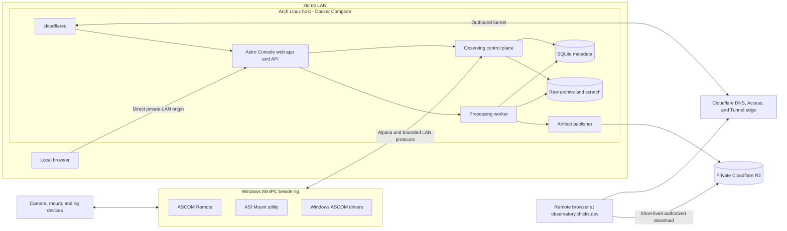

# Recommended Infrastructure Architecture

## 1. Topology



The Windows MiniPC remains the device-driver appliance. The Arch host does not
replace or containerize ASCOM Remote, the ASI utility, or Windows drivers; it
consumes their network-facing Alpaca capabilities. Static DHCP reservations or
explicit host configuration should make this link predictable.

The recommended “web app” is a small static bundle served by the Astro Console
origin on the Arch host. This does not turn the host into the artifact CDN: R2
serves published bytes directly, while the Arch origin serves only the
version-matched UI, API, authorization, and live state. Pages or Workers can be
revisited later, but initially they would add deployment/version coordination
without removing the need for the authoritative Arch service.

Both ingress paths end at that versioned application origin. They differ in
network and authentication context, not in domain behavior. Both call the same
authorization, revision, lease, orchestration, and asset boundaries.

## 2. Host Components

### Astro Console Origin

One HTTP origin serves:

- immutable frontend assets;
- bounded queries and typed commands;
- current snapshots and an SSE or WebSocket event stream;
- previews and thumbnails;
- explicit asset downloads; and
- liveness/readiness endpoints with appropriately restricted detail.

It decodes every external value with Effect Schema. Static assets and API
contracts are released together to avoid frontend/backend version skew.

Expose two explicit ingress listeners or proxy routes: a LAN-bound local route
and an Access-protected tunnel route on the private Compose network.
`cloudflared` must reach only the tunnel route, never the local-owner bypass.
No router port is forwarded. A local browser reaches only the LAN-bound route.

### Observing Control Plane

The control plane owns device discovery, adapters, current rig truth, active
runs, revisions, mutation classification, lease eligibility, recovery, frame
writes, and durable events. It reaches the MiniPC over Alpaca or another
explicit bounded LAN protocol and never calls through Cloudflare to reach a
rig.

Prefer configured MiniPC/device addresses over broadcast discovery in the
first Compose deployment. If an adapter genuinely requires UDP broadcast or
multicast, validate it from the container. Use host networking only for the
control service that requires discovery; do not give the processing worker or
public ingress broad LAN visibility.

For the first slice it may share a process with the HTTP origin if lifecycle
and failure isolation are explicit. The deployment model should nevertheless
treat it as higher priority than preview generation and processing so it can be
split without changing product contracts.

### Processing Worker

Processing is a separate service/process with:

- a typed job queue in the local metadata store;
- app-owned input and output directories;
- no hardware credentials or rig-network authority;
- bounded subprocess arguments and timeouts;
- lower CPU and I/O weights;
- memory and concurrency limits; and
- crash/failure semantics that preserve sources and completed intermediates.

The service-owned resource policy may throttle or exceptionally pause
processing only when measured CPU, memory, storage I/O/capacity, or thermal
pressure threatens observing or host stability. An active run or exposure is
not itself a pause condition, and the worker cannot infer safety from UI state.

### Persistence

Start with a local SQLite database for canonical metadata and durable events.
This matches a single-site, single-authority product and avoids operating a
database server before needed. Use transactions for revision, lease, command
acceptance, and event writes. Keep image bytes and large intermediates in the
filesystem; database rows reference checksummed app-owned assets.

Original sources remain on the Arch filesystem. Rebuildable scratch remains
local and expires under policy. Selected previews, intermediates, finals, and
temporarily staged raw downloads are published to private R2; metadata records
their checksums, locations, and expiry state. R2 is never authoritative for
run execution or the only copy of an original. Final outputs are small enough
to join originals in the permanent local archive even after their R2 copies
expire.

Use WAL only on local storage. Back up through SQLite's online backup API or a
consistent equivalent, then copy the resulting snapshot to the backup target.
Do not `cp` a live database file while ignoring its WAL state.

Suggested bind-mounted host layout:

```text
/var/lib/astro-console/
  db/
  library/derived/
  cache/previews/
  processing/work/
  recovery/
/mnt/storage/astro-console/
  originals/
  finals/
/etc/astro-console/
/opt/astro-console/compose/
```

Paths are conceptual until installation packaging is chosen. Each resides on a
declared filesystem with monitored free-space policy; no silent fallback to a
home directory or current working directory is allowed.

## 3. Request And Event Flow

### Command

1. Public edge authenticates the person, or local ingress supplies its selected
   trusted owner context.
2. Origin verifies that context and resolves one local membership/client
   capability.
3. Effect Schema decodes the intent command.
4. The control plane checks membership, phone capability, control lease,
   expected lease revision, expected run revision, idempotency, and current
   operational eligibility.
5. Only then does the workflow reach hardware.
6. Acceptance/result and durable events commit locally before clients are told
   canonical state changed.

No reverse proxy, Access group, or browser flag can skip steps 3–6.

### Reconnect

1. Client marks its projection non-current and disables mutations.
2. It establishes a new authenticated transport.
3. Service returns a complete snapshot with `snapshotVersion` and
   `eventCursor`.
4. Client atomically replaces canonical projection.
5. Newer incremental events begin after the cursor.

Tunnel connection churn is therefore an availability event, not a consistency
mechanism.

### Asset

1. Client requests a stable asset ID and representation, never an arbitrary
   path.
2. Service authorizes observatory membership and representation scope.
3. Service resolves the app-owned local path or private R2 key.
4. For an R2 object it issues a short-lived presigned `GET`; for a local raw it
   either streams once with bounded concurrency or stages a temporary R2 copy.
5. Every class may be downloaded deliberately and audited; no bucket listing
   or arbitrary filesystem/object-key access is exposed.

## 4. Network Boundaries

- Public inbound: none on the home/rig router.
- Host inbound: Astro Console on a private LAN interface and normal local SSH
  administration; neither is forwarded at the router.
- Host outbound: DNS/NTP, Cloudflare Tunnel, update/backup endpoints, and
  explicitly configured vendor/catalog services.
- MiniPC/rig LAN: only required Alpaca/device addresses, ports, and discovery
  scopes.
- Product clients: never receive network routes to the rig.

The first firewall policy can be host-based and simple: allow the home LAN to
the local web port and SSH, allow Astro Console to required MiniPC/rig ports,
and allow `cloudflared` outbound. A dedicated rig VLAN is optional hobby
hardening, not an initial requirement.

### Local Name And TLS

Local access is deliberately simpler than the public path. The owner can reach
the Arch box directly on the home LAN and administer it locally if the public
path fails. No Tailscale, cloud identity, or high-availability recovery path is
required.

Start with a private DNS name or stable Arch host address and a LAN-only HTTP
origin. Add trusted local HTTPS through split DNS/DNS-01 or a private CA only
when a required browser feature needs a secure context. Do not make local
maintenance depend on Cloudflare Access.

## 5. Process Supervision And Packaging

Use Docker Compose on the Arch host. The minimum topology is:

- `astro-console`: web origin and observing control plane;
- `processor`: lower-priority processing worker with no rig authority;
- `publisher`: least-privilege R2 upload and publication verification;
- `cloudflared`: outbound public connector; and
- optional one-shot/timer containers for database-aware backup and maintenance.

SQLite and the asset library are bind-mounted host data, not anonymous Docker
volumes. Do not add a database container merely because Compose is present.
The frontend is built into the Astro Console image so it cannot drift from the
server contracts.

Use health checks, bounded restart policies, image digests/tags, and Compose
resource controls. The Arch host's Docker service starts the stack at boot.
Restarting or upgrading `cloudflared` must not restart Astro Console. The
processing worker receives read-only originals, writable derived/scratch
mounts, lower CPU/I/O priority where Docker/systemd supports it, and no MiniPC
credentials or LAN access unless a concrete adapter requires it.

Compose is packaging and supervision, not distributed orchestration. There is
one host, no Swarm/Kubernetes, and no attempt to reschedule control away from
the rig network.

## 6. Deployment Phases

### Phase I: Local Foundation

- Relocate the Arch host to its cooler basement location, connect wired
  Ethernet, then verify its fixed address, time sync, and storage performance.
- MiniPC static addressing and an inventory of ASCOM Remote devices/endpoints.
- Compose network test against Alpaca, including any discovery requirement.
- Service independent of Electron and browser lifecycle.
- Local database/assets, fake observatory, two local browsers, restart and disk
  tests.
- Direct LAN access and local Docker/SSH administration.

### Phase II: Container Operations

- Versioned Compose images, host bind mounts, health checks, and rollback.
- Proportionate database and asset backup with a tested sample restore.
- Health summary and alerts.
- No remote administration product.

### Phase III: Public Read-Only Viewing

- Move authoritative `chicks.dev` DNS from Vercel to Cloudflare while keeping
  Vercel registration/hosting records intact.
- Configure Google and email OTP in Access, allowlist identities, remove the
  Cloudflare-account IdP from this application, and verify identity tokens for
  `observatory.chicks.dev`.
- Read-only phone and viewer desktop.
- Bandwidth measurements for telemetry, previews, and downloads.
- Internet/tunnel failure drills.

### Phase IV: Shared Control

- Control request/grant/release/takeover over the already proven path.
- Shorter security sessions and stronger owner policy as needed.
- Delayed-command and lease-loss testing at the local enforcement boundary.

### Phase V: Reassessment

- Measure whether Tunnel, local storage, SQLite, and a single host remain the
  right constraints.
- Add object backup, a VPS, or a typed cloud hub only for an observed need.
