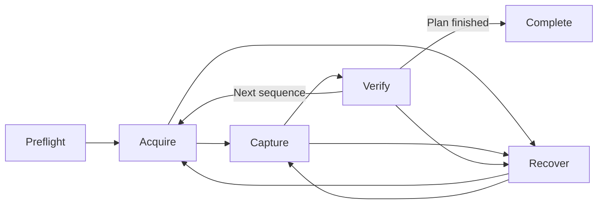

# V2 UI And Workspace Plan

## 1. Why The Current Shell Should Not Be Extended

The current interface has a coherent dark instrument-console style and several
good operational details, but its layout is organized around persistent
component slots rather than the operator's current task.

The July 2026 visual review found structural problems that should inform V2:

- The target catalog rendered all 12,590 target buttons while only a small
  number were visible.
- The empty preview dominated disconnected and idle states.
- Empty Inspector and Library regions remained visible regardless of context.
- The header clipped location and removed Simulator and Park at compact widths.
- Common text and controls were too small for dark, cold, fatigued, or
  at-a-distance operation.
- Warnings exposed a count without a discoverable explanation or remedy.
- Capture controls appeared in multiple places, including explicitly unwired
  Inspector settings.
- Capability labels such as `Preview yes` and `Storage no` read as adapter
  diagnostics rather than operator guidance.
- Active capture telemetry was useful, but blank previews and provenance-poor
  asset tiles made frame feedback weak.

V2 should not reproduce the same shell with cleaner spacing. It should replace
the shell with task-driven workspaces and progressive disclosure.

## 2. Product Model

V2 distinguishes stable workspaces from transient observing phases.

### Workspaces

| Workspace | Primary question |
| --- | --- |
| Plan | What should the observatory do, and is the plan viable? |
| Observe | What is the active run doing, and does it need intervention? |
| Library | What was captured, and is it good evidence? |
| Process | How should selected evidence become a better derived result? |

Workspaces are freely switchable. Leaving `Observe` never pauses or cancels an
active run. An operator may process an older session, prepare another night, or
review frames while observing continues.

### Active Run Phases

- `Preflight` validates the site, rig, plan, ownership, storage, and safe state.
- `Acquire` prepares the session or target through alignment, slew, solve,
  center, focus, filter, and related setup.
- `Capture` executes the approved recipe.
- `Verify` judges physical outcome and frame quality before accepting progress.
- `Recover` pauses ordinary work and guides retry, correction, skip, stop, or
  park decisions.
- `Complete` records the run outcome and exposes its results.

The Observe workspace changes with the phase. The phase is not a tab the user
must select manually.

## 3. Core Product Entities

The UI should be designed around durable domain concepts rather than component
state.

| Entity | Responsibility |
| --- | --- |
| Observatory | Site, horizon, equipment, service health, and shared identity |
| Rig | A connected set of callable mount, camera, focuser, filter, and storage capabilities |
| Night Plan | Ordered and constrained work proposed for a site, rig, and observing window |
| Sequence | One target's acquisition contract, capture recipe, stop conditions, and failure policy |
| Active Run | Immutable execution snapshot plus explicit approved runtime changes |
| Acquisition Attempt | Evidence and corrections used to align, solve, center, and prepare a target |
| Frame | Durable captured evidence with settings, metrics, provenance, and review status |
| Processing Session | One current Build/Develop sequence, linear applied history, working output, checkpoints, and saved Library artifacts |
| Control Lease | The single client currently authorized to issue observing commands |

The active run belongs to the observatory service. It does not belong to a
workspace, React tree, browser tab, or connected client.

## 4. Global Application Shell

The shell should remain small and stable while workspace content changes.

### Primary Navigation

- Plan
- Observe
- Library
- Process

Rig configuration, account controls, development tools, and application
settings belong in secondary navigation. They are not workspaces.

### Persistent Run Activity

When a run is active, every workspace shows a compact activity surface with:

- target and current phase;
- progress and estimated time remaining;
- health or warning state;
- current controller;
- a clear `Return to Observe` action;
- pause or stop when appropriate;
- emergency safe action when supported.

Routine telemetry remains inside Observe. Only state that may change the
operator's decision interrupts other workspaces.

### Information Hierarchy

V2 uses three layers:

1. **Glance:** activity, health, progress, and urgent state;
2. **Decision:** the recommended or available action now;
3. **Evidence:** telemetry, logs, settings, and diagnostics explaining the
   decision.

Dense information belongs in the evidence layer. It should not compete with
the current decision.

### Warnings And Problems

A warning must never be only a count. It should expose:

- what happened;
- severity;
- operational consequence;
- recommended remedy;
- whether the run can continue;
- the evidence that produced the warning.

Warnings should be accessible globally and expanded contextually in the
workspace that can resolve them.

## 5. Plan Workspace

Plan composes and validates future observing work. It should not look like a
catalog with capture controls attached.

### Primary Layout

- A sequence list or timeline expressing the proposed order.
- An observing-window visualization showing altitude, horizon clearance, and
  usable time.
- A contextual editor for the selected sequence.
- A readiness summary for the complete plan.
- A prominent `Run plan` action after validation.

### Sequence Contents

Each sequence may define:

- target and framing;
- acquisition requirements;
- capture mode and exposure recipe;
- filter and focus requirements;
- earliest and latest start;
- minimum altitude and horizon clearance;
- desired duration, frame count, or quality goal;
- cadence and recenter thresholds;
- storage forecast;
- stop conditions;
- retry, skip, pause, and park behavior;
- fallback target or optional priority.

The catalog must be virtualized or paginated. Target discovery should support
search, favorites, recent targets, viability, and recommendation without
mounting the entire catalog into the document.

### Plan Validation

Validation should identify conflicts before execution:

- target not visible during its proposed window;
- local horizon or obstruction conflict;
- insufficient usable time;
- storage shortfall;
- unavailable capability;
- ambiguous rig ownership;
- unsafe or unknown critical state;
- mutually incompatible sequence requirements.

Readiness should distinguish `ready`, `ready with limitations`, and `blocked`.
Blocking state fails closed when the missing information is truly critical.

### Running Plan Snapshot

Pressing `Run plan` creates a stable execution snapshot. Later edits to a draft
or another night do not silently mutate the active run.

Changes to the active run are explicit operations and are classified by
impact.

#### Apply Without Urgent Confirmation

- Add or reorder work after the active sequence.
- Add notes.
- Change a different draft plan.
- Adjust future priorities without changing current behavior.

#### Notice Before Application

- Modify the next sequence.
- Change remaining duration or a later stop condition.
- Remove queued work.

#### High-Urgency Approval

- Abort the current exposure.
- Change the active target.
- Move the mount.
- Change the active filter or acquisition contract.
- Restart acquisition.
- Discard current progress.
- Disable a readiness or safety constraint.

The approval describes the concrete consequence, not merely `Are you sure?`.
For example:

> Applying this change will abort the current exposure, discard its elapsed
> time, slew away from the active target, and begin acquisition for the new
> target.

## 6. Observe Workspace

Observe is the operational view of a global active run. It is not the owner of
that run.

### Preflight

Preflight presents a decision-grade checklist:

- rig connectivity and control ownership;
- mount and camera state;
- observer location and time;
- target altitude and local-horizon clearance;
- storage forecast;
- required focuser and filter capabilities;
- plan validity;
- explicit safe-state result.

The primary action is to resolve the next blocker or begin the run. Raw device
facts belong behind the verdict.

### Session-Level Acquire

Session preparation may include:

- polar alignment;
- initial focus;
- guiding or tracking readiness;
- time and location validation;
- camera and storage calibration;
- safe mount preparation.

#### Guided Polar Alignment

Plate solving can measure polar-axis error and guide physical adjustment. It
cannot mechanically change altitude or azimuth unless the mount has suitable
motorized adjustment.

The workflow should:

1. capture and solve an initial frame;
2. rotate around the RA axis;
3. capture and solve another frame;
4. infer polar-axis error;
5. translate error into altitude and azimuth adjustment;
6. ask the user to adjust the mount;
7. capture again and iterate to the selected tolerance.

The latest solved frame becomes the visual surface. Its overlay shows:

- estimated mount polar axis;
- true celestial pole;
- a vector connecting them;
- altitude and azimuth components;
- large directional guidance;
- numeric error and target tolerance;
- a faint history of previous estimates;
- solve uncertainty.

Image direction must not be confused with physical knob direction. The overlay
shows celestial geometry, while adjacent instructions describe the physical
mount adjustment.

### Target-Level Acquire

For each sequence, Acquire may perform:

- slew;
- plate solve;
- bounded correction;
- target-specific centering;
- focus and filter preparation;
- framing confirmation;
- operator-visible outcome and abort path.

Deep-sky acquisition uses plate-solve-driven correction. Lunar acquisition may
use disk or limb detection when star solving is unsuitable. Accepted driver
writes remain provisional until image evidence confirms the physical result.

### Capture

Capture should make the run legible without presenting every capability as a
control.

The primary surface shows:

- current exposure or stack;
- elapsed and remaining time;
- accepted and rejected frames;
- latest frame and quality summary;
- target-in-frame and drift state;
- focus and guiding health when available;
- storage consumption and forecast;
- active stop condition;
- next planned transition.

Contextual actions may include pause, resume, recenter, refocus, skip, stop,
abort, or park. The interface emphasizes the one or two useful actions in the
current state and progressively discloses diagnostics.

### Verify And Recover

Successful commands do not prove successful observing. Verify uses successive
frames to confirm:

- target position and framing;
- drift and correction effectiveness;
- clipping and exposure quality;
- usable focus and shape metrics;
- expected capture progress.

Recover presents the bounded action the system recommends, the evidence for
it, and the consequence. It must preserve a visible abort path and restore the
prior state when a provisional correction fails.

## 7. Library Workspace

Library is for judgment and evidence management, not image transformation.

### Organization

- observing night;
- target;
- run and sequence;
- acquisition attempt;
- frame type and filter;
- review status;
- original and derived relationship.

### Frame Review

Every frame should expose:

- preview;
- timestamp and target;
- exposure and capture settings;
- filename and durable asset identity;
- dimensions and pixel format;
- clipping, sharpness, shape, drift, and framing metrics when available;
- why automation accepted or rejected it;
- provenance and related processing outputs.

Review supports compare, accept, reject, rate, annotate, reveal, download, and
send-to-processing workflows. A compact live-review surface may appear in
Observe, but historical browsing and detailed comparison belong here.

## 8. Process Workspace

Process transforms selected evidence while remaining independent of live rig
control.

Its accepted interaction model is recorded in the
[Gate 4 Process reference](process-gate.md). Shared placement, hierarchy, and
language rules live in [V2 UX and design guidance](ux-design-guidance.md).

### Responsibilities

- select source assets;
- build a durable linear master through calibration, debayer, alignment, frame
  evaluation, and stacking;
- visually develop that master through one current, non-destructive edit
  history with undo and redo;
- keep a large image preview visible while tools and adjustable parameters are
  evaluated;
- combine Operation, Assistant, and Inspector in one contextual rail so the
  image canvas remains dominant;
- reveal the linear reference through press-and-hold comparison while editing;
- offer compatible tools per operation, including Siril and external adapters
  where their invocation model fits;
- make optional analysis explain its suggestions and require the operator to
  preview and apply every change;
- retry a failed operation from its latest valid checkpoint without rerunning
  unaffected Build steps;
- expose bounded owner-safe tool output and retry scope without replacing the
  visual editor;
- switch among capture sessions, unfinished work, linear stacks, and Library
  sources while protecting unsaved work;
- record exact inputs, parameters, tool versions, and provenance underneath
  the focused editing experience; and
- save selected FITS and display artifacts into Library, or discard unsaved
  derived work while preserving source frames.

General comparison among saved outputs belongs to Library; Process may open
that capability as a convenience. Internal attempts and diagnostics remain
inspectable but do not become the primary workspace navigation.

Processing may run while observing continues. Active capture alone does not
pause it. The worker throttles only in response to measured memory, storage,
thermal, or similar host pressure that could threaten acquisition or control,
and the UI names that condition directly.

Review and Process remain separate because they answer different questions:
`Is this evidence good?` versus `How should it be transformed?`

## 9. Responsive And Field-Use Behavior

Responsive design should change the task surface, not merely shrink it.

### Desktop And Large Tablet

- Full planning timeline and sequence editing.
- Detailed Observe evidence and preview.
- Frame comparison and processing controls.
- Resizable or collapsible secondary details where useful.

### Initial Phone Experience

The first phone surface is intentionally read-only:

- observatory online or offline;
- active plan and target;
- current phase and progress;
- latest preview;
- health and warnings;
- estimated completion;
- current controller.

It does not expose mount, capture, plan-editing, or processing mutations. A
future control experience requires a deliberate design rather than revealing
desktop buttons at a smaller breakpoint.

### Ergonomic Baseline

- Avoid routine 9–11 px operational text.
- Use controls large enough for low-light, fatigued, touchpad, and occasional
  touch use.
- Never clip or hide active control ownership, warnings, stop, or safe-state
  actions.
- Do not rely on color alone for activity, warning, or selection.
- Preserve keyboard navigation and meaningful accessible names.
- Keep dense diagnostics available without placing them in the primary scan
  path.

## 10. V2 UX Acceptance Outcomes

The V2 interaction model is successful when:

- an operator can understand current observatory activity from any workspace;
- switching workspaces or closing a browser does not affect a run;
- a full multi-target plan can be validated and started deliberately;
- disruptive run edits state their concrete consequences before application;
- Acquire visibly proves pointing and alignment outcomes from images;
- Capture shows whether useful evidence is accumulating, not only that commands
  were accepted;
- every warning has a discoverable cause and remedy;
- every frame has enough preview, quality, and provenance information to judge
  it;
- processing outputs remain reproducible and connected to their sources;
- the phone experience is useful without becoming an unsafe miniature desktop;
- information density increases confidence instead of increasing search cost.
